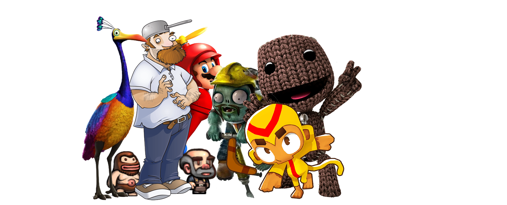

    
     
    
    
    
    
    

[//]: # (23, 08 Mon 2021, 20:00:00)

Hi, I'm Lyzev ⎡Бен⎤, a software developer from Central Europe. I started programming in 2020 and learned Java as my first programming language. I contribute to various open source projects on GitHub, focusing on fixing bugs and adding new features. I also love reverse engineering and making mods for games.

## :chess_pawn: Community Chess Tournament

Everyone is welcome to participate in the community chess tournament.
Click one of the legal moves below to play the game.

|   | a | b | c | d | e | f | g | h |
|---|---|---|---|---|---|---|---|---|
| 8 |  |  |  |  |  |  |  |  |
| 7 |  |  |  |  |  |  |  |  |
| 6 |  |  |  |  |  |  |  |  |
| 5 |  |  |  |  |  |  |  |  |
| 4 |  |  |  |  |  |  |  |  |
| 3 |  |  |  |  |  |  |  |  |
| 2 |  |  |  |  |  |  |  |  |
| 1 |  |  |  |  |  |  |  |  |

## Game Status

- **Next to move:** `White`
- **Last move:** `e5f3` at 2025-03-03 12:38:36

## Evaluation (Stockfish)

░░░░░░░░░░░░░░░░░░░░

`2.9% White` / `97.1% Black`

## Legal Moves

| **Piece** | **Move** |
|:---------:|:--------:|
| `b2` | [`b2c3`](https://github.com/Lyzev/Lyzev/issues/new?title=chess%7Cb2c3&body=Click+%27Create%27+to+submit+this+move.), [`b2b3`](https://github.com/Lyzev/Lyzev/issues/new?title=chess%7Cb2b3&body=Click+%27Create%27+to+submit+this+move.), [`b2a3`](https://github.com/Lyzev/Lyzev/issues/new?title=chess%7Cb2a3&body=Click+%27Create%27+to+submit+this+move.), [`b2c2`](https://github.com/Lyzev/Lyzev/issues/new?title=chess%7Cb2c2&body=Click+%27Create%27+to+submit+this+move.), [`b2a2`](https://github.com/Lyzev/Lyzev/issues/new?title=chess%7Cb2a2&body=Click+%27Create%27+to+submit+this+move.), [`b2c1`](https://github.com/Lyzev/Lyzev/issues/new?title=chess%7Cb2c1&body=Click+%27Create%27+to+submit+this+move.), [`b2b1`](https://github.com/Lyzev/Lyzev/issues/new?title=chess%7Cb2b1&body=Click+%27Create%27+to+submit+this+move.), [`b2a1`](https://github.com/Lyzev/Lyzev/issues/new?title=chess%7Cb2a1&body=Click+%27Create%27+to+submit+this+move.) |

## Game Statistics

- **Moves in current game:** 170
- **Total moves across all games:** 284
- **Games played:** 1
- **White wins:** 0
- **Black wins:** 1
- **Draws:** 0

**Win Rate (Decisive games):**

░░░░░░░░░░░░░░░░░░░░

White 0.0% / Black 100.0%

## :trophy: GitHub Activity

## :envelope: Support

Need assistance or have **minor** questions? Join our welcoming community on
the [Discord server](https://lyzev.dev/discord). Our members and staff are always ready to help!

